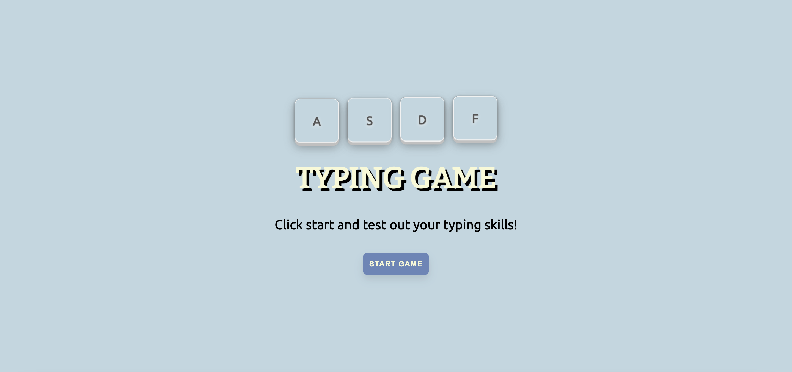

# Typing Game

# OverView

Welcome to my Typing Game! I got this idea from going through Microsoft's Web Developer For Beginners repo on their github[https://github.com/microsoft/Web-Dev-For-Beginners]. Their repo features a 12 week long FREE course on starting out as a web developer, that includes in depth assignments, courses, and projects! Among those projects was the Typing game. I thought this would be great practice for me to independently create. I decided to look over the solution and see how I would go about creating the application. My tech stack for this project were: SCSS/SASS and ReactJS. I also created some CSS art and a bit of animation for the Start Page, where there are keys of keyboard being animated. The project solution, however, was writting in Vanilla JavaScript. To challenge myself, I wanted to refine my skills in React and build out an entire application, just from referencing the Vanilla Javascript. Ultimately, the process proved to be a satisfying feat. I was able to improve my design process and focus on the logic that will be imperative, rather than focusing on every single thing at once. I also had more practice with useState(). This project really helped me organize my thought hierarchy and go step by step towards completing this application.

# How To Play

- The user will be presented with a Start Page where they are able to navigate to the Game Page via the "Start Game" button. 
- The user will be presented with an input box and generate quote button, they can click the generate quote button, and a quote prompt will appear
- Once they've generated the quote, they can click on the input box where it will also have the prompt displayed as a palceholder in the input box
- As the user types the correct characters, each character will be taken away, if the user typs the incorrect character, said character will display in the input box and a message box will appear notifying the user that they've typed the wrong character for the quote
- Once the user deletes the incorrect character and proceeds to type the correct character until finished, a message will appear congratulating the user and prompting them to generate another quote for practice. 
- User can exit out of the game by clicking the Exit game Button and will be brought back to the start page

# Edge Cases/User stories
- user presses enter => generate quote
- if user types a special character or number ? error 
- if displayed prompt has quotation marks inside of it ? 

# Tech Stack

- HTML
- CSS
- SCSS/SASS [https://sass-lang.com/documentation/]
- ReactJS [https://reactjs.org/]
- JavaScript [https://www.javascript.com/]